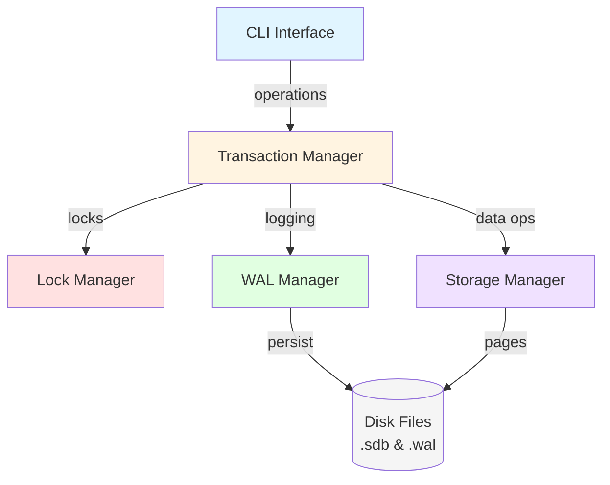
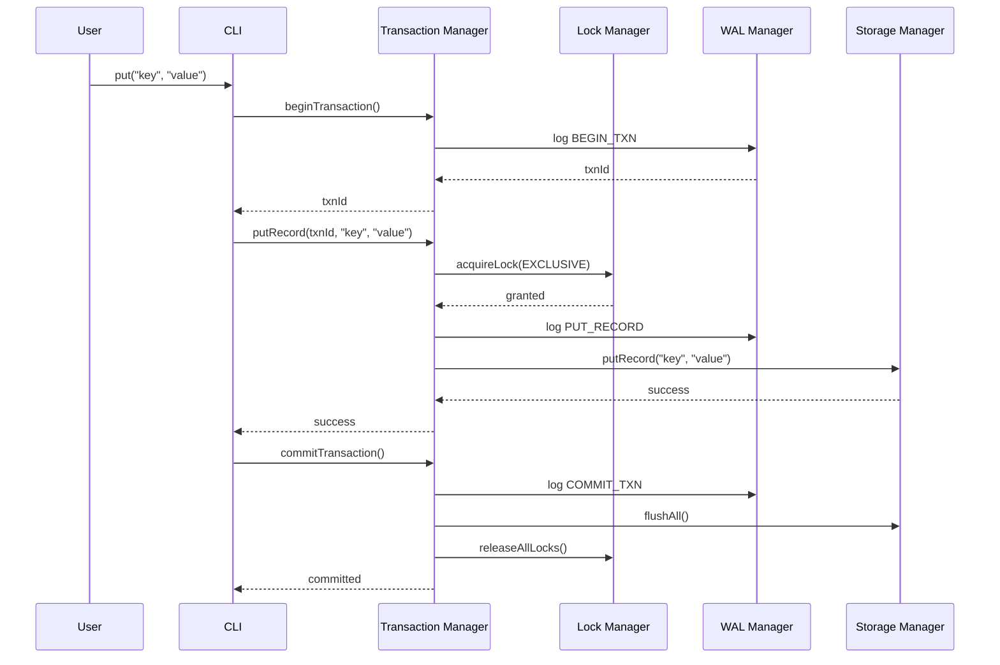
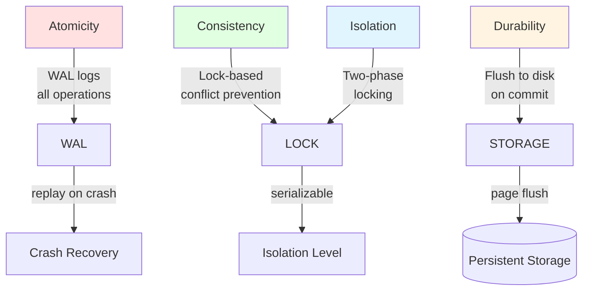
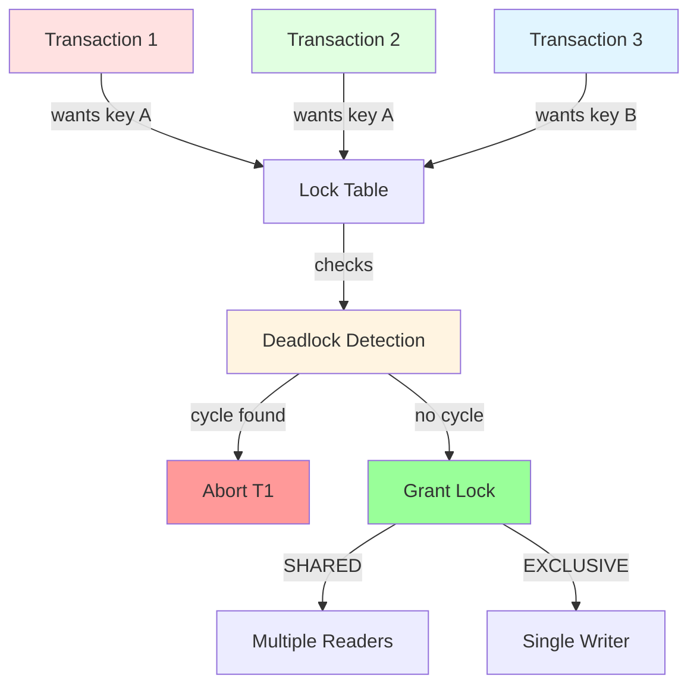
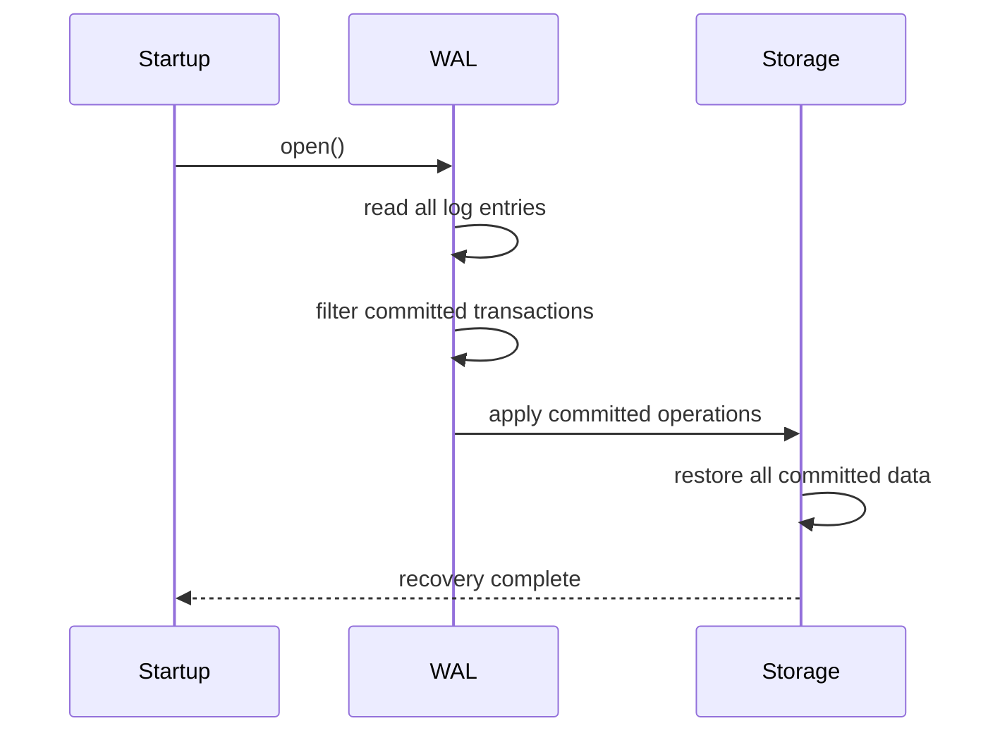
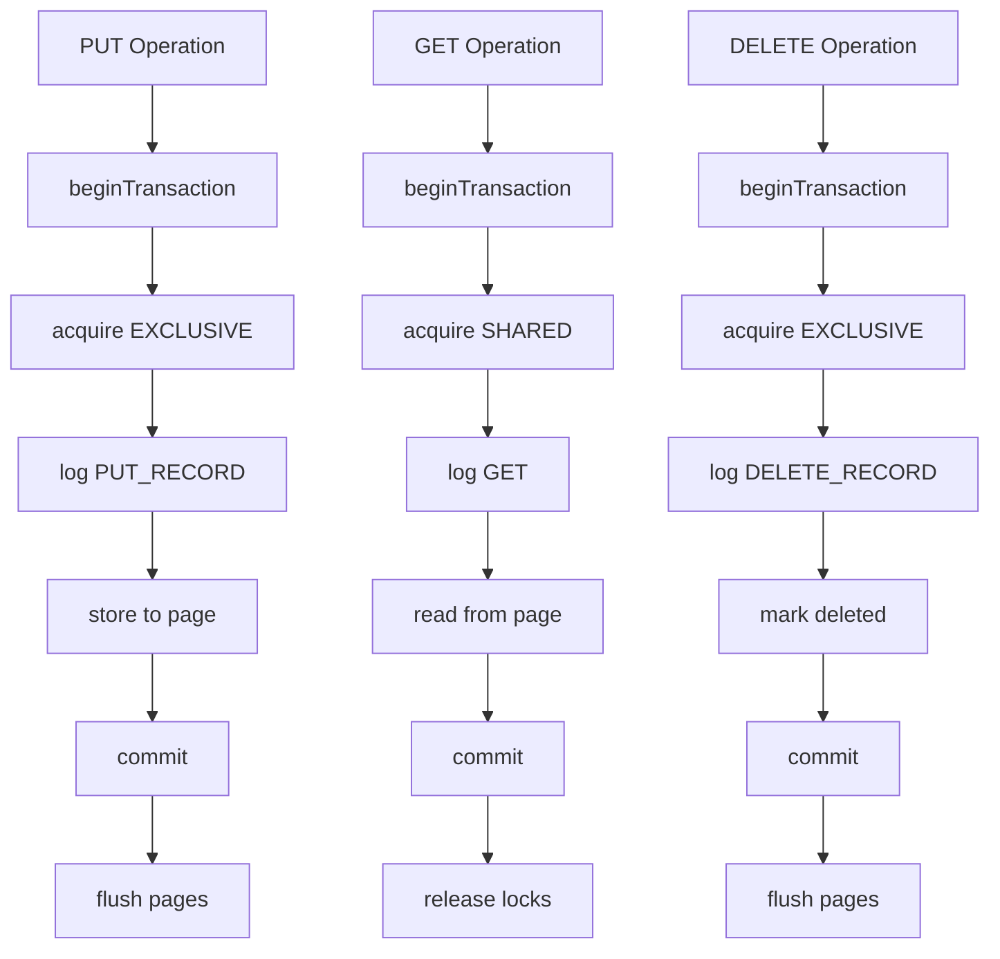
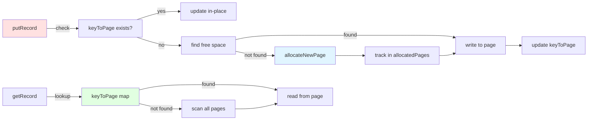
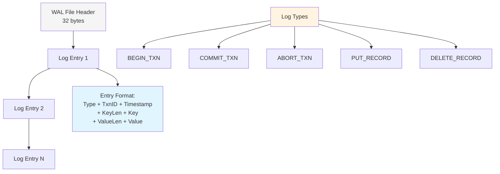
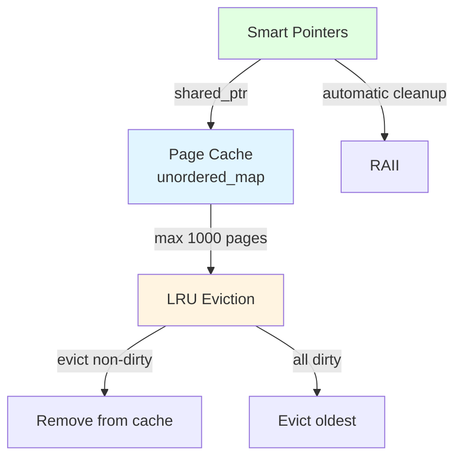

# StoneDB-engine Architecture

## System Overview



## Transaction Flow



## Storage Architecture

```mermaid
graph LR
    A[Record] -->|8 bytes header| B[Page 4KB]
    B -->|header + pages| C[Database File<br/>.sdb]
    
    D[Page Cache<br/>In-Memory] -->|evicts at 1000| B
    B -->|loads| D
    
    E[keyToPage Map] -->|O(1) lookup| B
    F[allocatedPages Set] -->|tracks| B
    
    style A fill:#ffe1e1
    style B fill:#e1f5ff
    style C fill:#f5f5f5
    style D fill:#fff4e1
    style E fill:#e1ffe1
    style F fill:#f0e1ff
```

**Storage Structure:**
- File header: 64 bytes
- Pages: 4KB each
- Record format: 2B keyLen + 2B valueLen + key + value
- Multi-page support with key-to-page mapping

## ACID Implementation



**ACID Properties:**
- **Atomicity**: All operations in transaction succeed or fail together via WAL
- **Consistency**: Validation prevents invalid states
- **Isolation**: Serializable isolation with two-phase locking
- **Durability**: Committed data flushed to disk

## Concurrency Control



**Lock Management:**
- Shared locks: Multiple readers, no writers
- Exclusive locks: Single writer, blocks all others
- Deadlock detection: Cycle detection in wait graph
- Lock releases: All locks released on commit/abort

## Crash Recovery



**Recovery Process:**
1. On startup, read entire WAL file
2. Identify committed transactions (have COMMIT log entry)
3. Replay all PUT/DELETE operations from committed transactions
4. Apply operations to storage
5. Database restored to last consistent state

## Component Interactions



## Data Flow

**Write Path:**
1. User command → CLI
2. Transaction begin → WAL log
3. Acquire exclusive lock
4. Log operation in WAL
5. Write to storage (in-memory cache)
6. On commit: flush WAL, flush pages, release locks

**Read Path:**
1. User command → CLI
2. Transaction begin → WAL log
3. Acquire shared lock
4. Read from storage cache (or disk)
5. Return value
6. On commit: release locks

**Delete Path:**
1. Similar to write path
2. Record marked deleted (keyLen = 0, valueLen preserved)
3. Removed from keyToPage map
4. Space reusable on next allocation

## Page Management



## WAL Structure



## Memory Management



**Memory Policies:**
- Page cache limited to 1000 pages (4MB max)
- LRU eviction: prefer non-dirty pages
- Smart pointers for automatic memory management
- RAII for resource cleanup

## Performance Optimizations

**Current Optimizations:**
- Page caching reduces disk I/O
- keyToPage map for O(1) lookups
- Multi-page allocation prevents single-page bottleneck
- LRU eviction controls memory usage
- Batch WAL writes for durability

**Future Optimizations:**
- B-tree indexing (Issue #12)
- MVCC for better concurrency (Issue #13)
- Page compression (Issue #14)
- WAL checkpointing (Issue #15)
