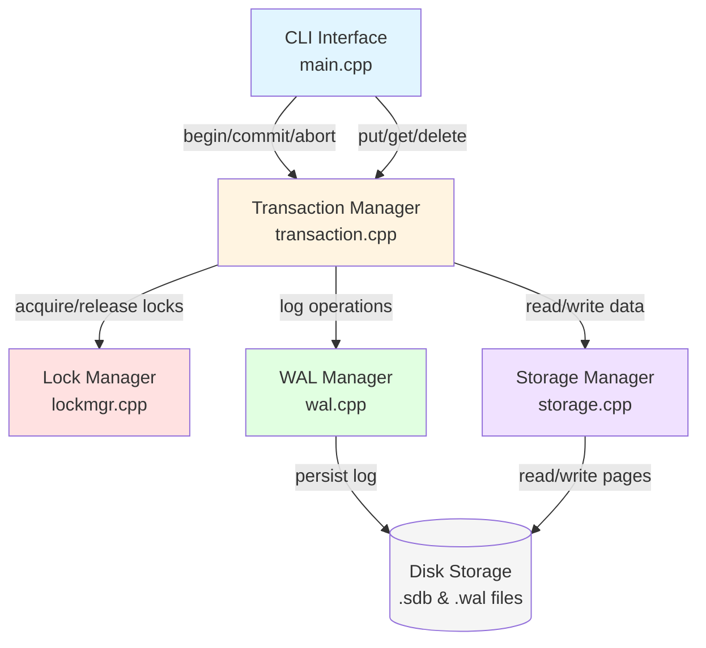
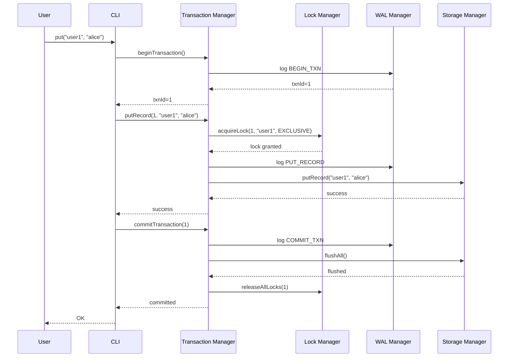
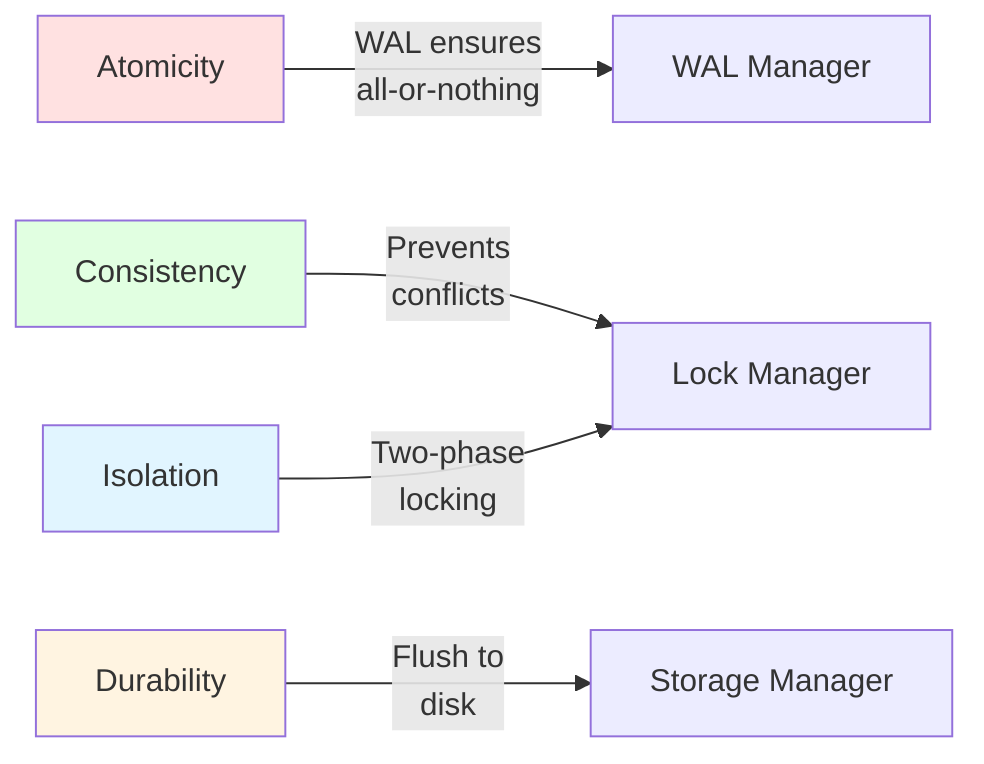

# StoneDB-engine Architecture

## Overview

StoneDB-engine is a modular embedded database designed to understand real database internals. It implements core database concepts including ACID compliance, crash recovery, and concurrency control.

## System Architecture

## Transaction Flow

## ACID Implementation

## Core Components

### StorageManager
- **Purpose**: Handles persistent storage using page-based architecture
- **Features**: 
  - Page caching for performance
  - Record-level operations (put/get/delete)
  - Simple allocation strategy
- **Files**: `src/storage.cpp`, `include/storage.hpp`

### WALManager (Write-Ahead Logging)
- **Purpose**: Ensures durability and crash recovery
- **Features**:
  - Logs all operations before applying to storage
  - Replay capability for recovery
  - Transaction logging (begin/commit/abort)
- **Files**: `src/wal.cpp`, `include/wal.hpp`

### LockManager
- **Purpose**: Concurrency control and deadlock prevention
- **Features**:
  - Shared and exclusive locks
  - Deadlock detection using cycle detection
  - Lock upgrading (shared to exclusive)
- **Files**: `src/lockmgr.cpp`, `include/lockmgr.hpp`

### TransactionManager
- **Purpose**: ACID transaction management
- **Features**:
  - Transaction lifecycle (begin/commit/abort)
  - Read and write sets tracking
  - Integration with storage, WAL, and lock manager
- **Files**: `src/transaction.cpp`, `include/transaction.hpp`

## Data Flow

1. **Transaction Begin**: Logged in WAL
2. **Operations**: 
   - Acquire appropriate locks
   - Log operations in WAL
   - Apply to storage
3. **Commit**: 
   - Log commit in WAL
   - Release locks
   - Mark transaction complete
4. **Abort**: 
   - Log abort in WAL
   - Release locks
   - Discard changes

## Concurrency Control

- **Locking**: Two-phase locking with deadlock detection
- **Isolation**: Serializable isolation level
- **Deadlock Detection**: Cycle detection algorithm
- **Lock Types**: Shared (read) and Exclusive (write)

## Crash Recovery

- **WAL Replay**: Replay committed transactions on startup
- **Atomicity**: Uncommitted transactions are discarded
- **Durability**: Committed transactions survive crashes

## Performance Considerations

- **Page Caching**: In-memory page cache for frequently accessed data
- **Lock Granularity**: Record-level locking for fine-grained concurrency
- **WAL Batching**: Multiple operations per WAL entry
- **Memory Management**: RAII and smart pointers for safety
